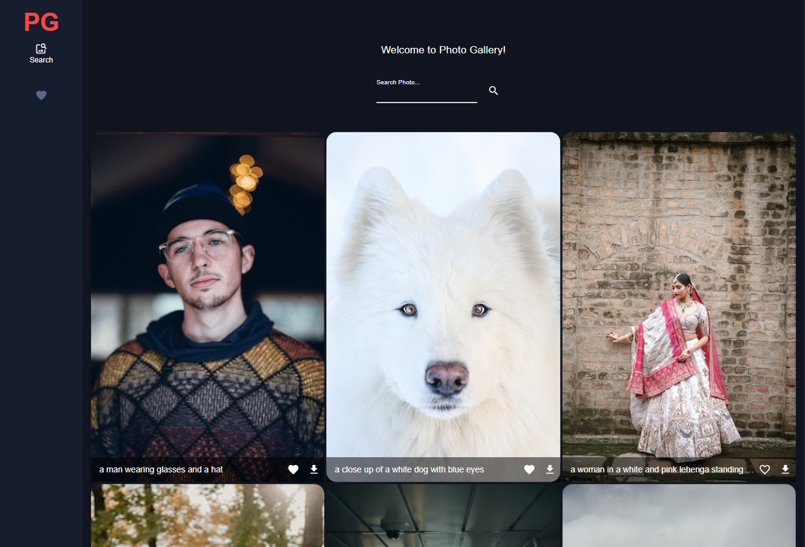
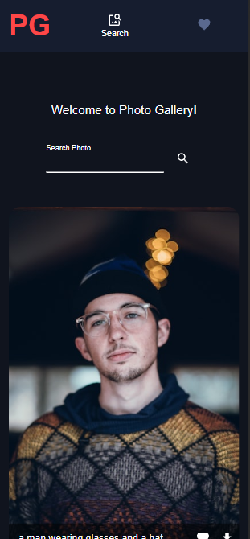

<h1 align="center">Photo Gallery</h1>

<div align="center">
   Solution for the third proyect of the OXYGEN TRAINING
</div>

<div align="center">
  <h3>
    <a href="https://rickhalmoguera.github.io/Oxygen-Shop/">
      Demo
    </a>
     <span> | </span>
    <a href="https://rickhalmoguera.github.io/PORTFOLIO/">
      Portfolio
    </a>
  </h3>
</div>

<!-- TABLE OF CONTENTS -->

## Table of Contents

- [Overview](#overview)
  - [Built With](#built-with)
- [Features](#features)
- [Contact](#contact)
- [Acknowledgements](#acknowledgements)

## Overview
This project applies what was learned in the last module of the Oxygen training program, using React, React-Router, Redux, Redux Toolkit, and Material-UI components.
# Desktop Screenshot


# Mobile Screenshot


### Built With

- [HTML](https://developer.mozilla.org/es/docs/Web/HTML)
- [Css](https://developer.mozilla.org/es/docs/Web/CSS)
- [FlexBox](https://css-tricks.com/snippets/css/a-guide-to-flexbox/)
- [JavaScript](https://developer.mozilla.org/es/docs/Web/JavaScript)

## Features

This site was created as a submission to the Training in [Oxygen Academy](https://oxygenacademy.es/). Where we practice the following points:

- Practicing React folders structure.
- Usage of Routes from React Router.
- Sending and requesting data from an API.
- Using LocalStorage inside the store with Redux.

We can observe these practices in the following features:

- A Nav bar that displays the two routes in this App.
- Search Bar for calls to the API.
- Add to favorites photos.
- Download posibility.
- Manipulation of the favorites photos, like sorting, removing photos or editing description.


## How To Use

To clone and run this application, you'll need [Git](https://git-scm.com) and [Node.js](https://nodejs.org/en/download/) (which comes with [npm](http://npmjs.com)) installed on your computer. From your command line:

```bash
# Clone this repository
$ git clone https://github.com/RickHalmoguera/Oxygen-Shop
# install dependencies
$ npm install
# run project
$npm run dev
```


## Acknowledgements

- [React](https://es.react.dev/)
- [Vite](https://vitejs.dev/)
- [Redux](https://redux.js.org/)
- [Redux Toolkit](https://redux-toolkit.js.org/)
- [MUI components](https://mui.com/)
- [React Router v6](https://reactrouter.com/en/main)

## Contact

- Website [PORTFOLIO](https://rickhalmoguera.github.io/PORTFOLIO/)
- GitHub [@RickHalmoguera](https://github.com/RickHalmoguera)
